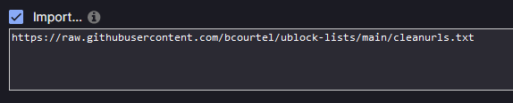

# uBlock lists

- [uBlock lists](#ublock-lists)
  - [What is it?](#what-is-it)
  - [How to use?](#how-to-use)
  - [References](#references)
  - [Lists](#lists)
    - [Clean URLs](#clean-urls)

## What is it?

Basic repo to store my personal filter lists for [uBlock Origin](https://github.com/gorhill/uBlock/).
Feel free to use it and contribute to it.

## How to use?

In uBlock settings, go to the "Filter lists" tab, then scroll to the bottom, click on `Import...` in the "Custom"
category, then paste the URLs to the lists you want to add:


## References

- [Syntax](https://github.com/gorhill/uBlock/wiki/Static-filter-syntax)

## Lists

### Clean URLs

URL:
```
https://raw.githubusercontent.com/bcourtel/ublock-lists/main/cleanurls.txt
```

Remove useless tracking tokens in URLs using uBlock capabilities instead of a dedicated extension.
